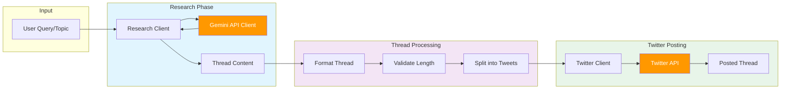
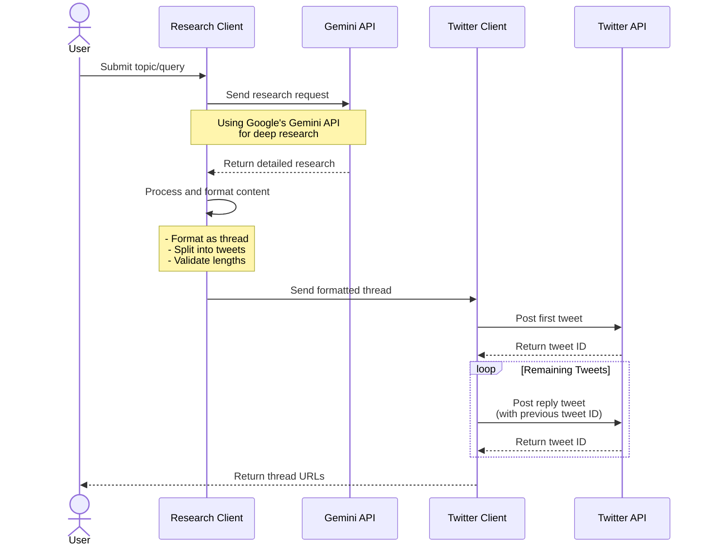

# Twitter Thread Generator Architecture

This document outlines the architecture and information flow of the Twitter Thread Generator application.

## System Overview

The application consists of three main components:
1. Research System (using Gemini API)
2. Content Processing
3. Twitter Integration

## Information Flow Diagram

## Sequence Diagram

## Component Details

### 1. Research System
- **Input**: User query/topic
- **Processing**: Deep research using Gemini API
- **Output**: Comprehensive research results
- **Key Features**:
  - AI-powered research
  - Context-aware responses
  - Source verification

### 2. Content Processing
- **Input**: Research results
- **Processing**: Content formatting and optimization
- **Output**: Twitter-ready thread
- **Key Features**:
  - Automatic thread splitting
  - Character limit validation
  - Hashtag optimization
  - Media handling

### 3. Twitter Integration
- **Input**: Formatted thread content
- **Processing**: API interaction and posting
- **Output**: Published thread
- **Key Features**:
  - OAuth authentication
  - Thread posting
  - Media upload support
  - Rate limit handling

## Error Handling

The system implements error handling at multiple levels:
1. Research failures
2. Content processing issues
3. Twitter API errors
4. Rate limiting
5. Authentication issues

## Configuration

The system uses environment variables for configuration:
- Twitter API credentials
- Gemini API credentials
- System settings

## Dependencies

- `tweepy`: Twitter API interaction
- `google-generativeai`: Gemini API integration
- `python-dotenv`: Environment management
- Additional utility libraries 